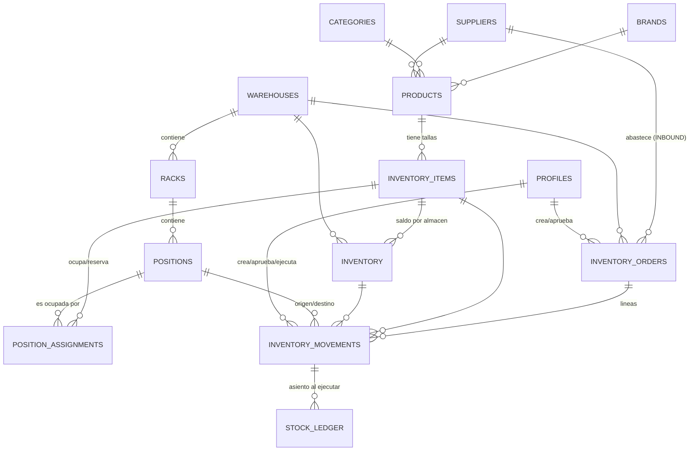

# Diseño del modelo de datos — WMS de calzado deportivo

**Fase 1: solo modelo de datos.** Sin RLS, sin seed, sin frontend.
Archivo DDL: `supabase/schema.sql` (listo para pegar en el SQL Editor de Supabase).

Este documento explica **qué se modeló y por qué**. Sirve como base del README de
entrega y como guion para la sustentación oral.

---

## 1. Punto de partida y decisión central

El README pedía 3 tablas (`inventory`, `inventory_items`, `inventory_movements`) con
relación *1 artículo → 1 inventario → N movimientos*. El `CASO.txt` describe una
operación que esas 3 tablas **no pueden representar**: racks, posiciones, espacios
ocupados/libres, reservas para INBOUND, preparación para OUTBOUND, y la diferencia
entre una orden creada y un movimiento ejecutado.

**Decisión:** se conservan las 3 tablas del README **con sus nombres y sus campos**
(para no romper el requisito literal) y se **extiende** el modelo con lo que el caso
exige. Nada del README se eliminó; todo lo nuevo es aditivo y justificado abajo.

| Tabla del README | Qué es en el modelo final |
|---|---|
| `inventory_items` | La **variante vendible** (modelo + talla). Sigue teniendo sku, precio, costo, dimensiones. |
| `inventory` | El **saldo de stock** por ítem y almacén. Sigue teniendo quantity, min_stock, max_stock, updated_at. |
| `inventory_movements` | El **movimiento** (línea de una orden) con el workflow Pendiente/Aprobado/Rechazado intacto. |

---

## 2. ERD



Vista en capas (ASCII), de catálogo a operación:

```
CATÁLOGO                     MAPA FÍSICO                    OPERACIÓN
--------                     -----------                    ---------
brands ─┐                    warehouses                     inventory_orders
categories ─┼─► products         │  (Almacén A / Bodega B)      │ INBOUND | OUTBOUND
suppliers ─┘      │              ▼                              │ PENDIENTE→APROBADO→EJECUTADO
                  │            racks  (RACK-01)                 ▼
                  ▼              │                          inventory_movements
           inventory_items       ▼                            ENTRADA|SALIDA|AJUSTE
           (SKU + TALLA)      positions (A-03-02)              status: PEND/APROB/RECH
                  │              │                             executed_at: NULL o fecha
                  │              │                                  │
                  ├──► inventory │ (saldo por almacén)              ▼
                  │              │                            stock_ledger
                  └──► position_assignments ◄────────────────  (kardex append-only)
                          RESERVADA | OCUPADA | EN_PICKING | LIBERADA
```

### Tablas y campos clave

| Tabla | Campos clave | Restricciones importantes |
|---|---|---|
| `profiles` | `role` (ADMIN/LOGISTICA/ALMACEN) | base para RLS de Fase 2 |
| `brands`, `categories`, `suppliers` | `slug` UNIQUE, `name` | `slug` obligatoriamente en minúsculas |
| `warehouses` | `code` UNIQUE, `name` | `code` con formato canónico |
| `racks` | `warehouse_id`, `code` | `code ~ '^RACK-[0-9]{2}$'`, UNIQUE(warehouse, code) |
| `positions` | `rack_id`, `code`, `capacity_units` | `code ~ '^[A-Z]-[0-9]{2}-[0-9]{2}$'`, UNIQUE(rack, code) |
| `products` | `model_code` UNIQUE, brand/category/supplier | modelo sin talla |
| `inventory_items` | `sku` UNIQUE, `size_label`, precio/costo/dims | UNIQUE(product, size_label, size_system) |
| `inventory` | `quantity`, `qty_reserved`, `qty_incoming`, `min_stock`, `max_stock` | UNIQUE(item, warehouse); `max >= min`; `reserved <= quantity` |
| `position_assignments` | `position_id`, `item_id`, `status` | **índice único parcial anti-doble-ocupación** |
| `inventory_orders` | `order_number`, `order_type`, `status`, `expected_date` | INBOUND exige proveedor; OUTBOUND exige destinatario |
| `inventory_movements` | `movement_type`, `quantity`, `status`, `approved_at`, **`executed_at`** | `quantity > 0`; solo se ejecuta lo APROBADO |
| `stock_ledger` | `qty_before`, `qty_delta`, `qty_after` | `qty_after = qty_before + qty_delta` |

---

## 3. Cómo el esquema resuelve cada necesidad "oculta" del caso

### 3.1 Mapa del almacén y sus racks/posiciones
Tres niveles: `warehouses` → `racks` → `positions`. La clave es que **`positions`
existe aunque esté vacía**. Un modelo que solo guardara "el producto X está en A-03-02"
podría decir qué está ocupado, pero jamás qué está libre. Al materializar el mapa como
filas, la vista `v_mapa_almacen` devuelve *todas* las posiciones con su ocupante o `NULL`
si están disponibles — que es exactamente la pregunta operativa del caso.

### 3.2 Evitar que dos productos ocupen el mismo espacio
Índice único **parcial** sobre `position_assignments`:

```sql
create unique index ux_position_assignment_activa
  on position_assignments (position_id)
  where status in ('RESERVADA', 'OCUPADA', 'EN_PICKING');
```

Solo puede existir **una** asignación viva por posición. El segundo intento de ocupar
o reservar el mismo slot falla con violación de unicidad **a nivel de base de datos**,
no por una validación del frontend que se pueda saltar con una llamada directa a la API.
Cuando el espacio se libera (`status = 'LIBERADA'`), la fila **sale del índice** pero
**no se borra**: el espacio vuelve a estar disponible y queda el histórico de quién lo
ocupó y cuándo.

### 3.3 Reservar espacio para una llegada INBOUND
La mercadería anunciada todavía no existe físicamente, pero el espacio ya debe estar
apartado. Se resuelve en dos columnas distintas:

- `position_assignments` con `status = 'RESERVADA'` → el slot queda bloqueado desde que
  se aprueba la orden, antes de que llegue el camión.
- `inventory.qty_incoming` → suma las unidades esperadas **sin tocar `quantity`**.
  El stock real no se infla por una promesa del proveedor.

Al ejecutarse la recepción: `RESERVADA → OCUPADA`, `qty_incoming` baja y `quantity` sube.

### 3.4 Preparar una ubicación para un OUTBOUND
Simétrico al anterior:

- `position_assignments.status = 'EN_PICKING'` → el slot queda bloqueado mientras el
  operario arma el pedido; nadie puede reubicar otro producto ahí en el intertanto.
- `inventory.qty_reserved` → unidades comprometidas a un OUTBOUND aprobado pero aún
  no despachado. La vista `v_stock_actual` expone `disponible = quantity - qty_reserved`,
  que es lo que realmente se puede prometer a otro cliente.

### 3.5 Diferenciar una orden creada de un movimiento realmente ejecutado
Se separa en **tres objetos distintos**, no en un solo campo de estado:

| Objeto | Qué representa | ¿Toca el stock? |
|---|---|---|
| `inventory_orders` | La **intención**: "el proveedor va a entregar" / "hay un pedido por despachar" | Nunca |
| `inventory_movements` | La **línea + la decisión administrativa** (`status`: PENDIENTE/APROBADO/RECHAZADO) | Solo al ejecutarse |
| `stock_ledger` | El **hecho consumado**: asiento inmutable con saldo antes y después | Es la prueba del cambio |

Dentro de `inventory_movements` la distinción vive en **dos columnas independientes**:

- `status` = decisión administrativa (¿lo autorizaron?)
- `executed_at` = hecho físico (¿el operario efectivamente lo recibió/retiró?)

Un movimiento puede estar `APROBADO` con `executed_at IS NULL`: autorizado pero todavía
no ejecutado. Esa es la **cola de trabajo del almacenero**, y tiene su propio índice
parcial (`ix_mov_pendientes_ejecucion`). Dos CHECK garantizan la coherencia:
`executed_at IS NULL OR status = 'APROBADO'` (nunca se ejecuta lo no aprobado) y
`status <> 'RECHAZADO' OR executed_at IS NULL` (lo rechazado nunca se ejecuta).

### 3.6 Manejo de tallas
El CSV de muestra trae 20 filas con 20 productos distintos, así que **no permite
confirmar** si un modelo tiene varias tallas. Se decidió por el negocio real: en un
almacén de calzado, un modelo existe en ~10 tallas y **cada talla tiene stock,
ubicación y movimientos propios**. Por eso:

- `products` = el modelo (`ZAP-001`, "Nike Air Zoom Pegasus", marca/categoría/proveedor)
- `inventory_items` = la variante vendible (`ZAP-001-40`, talla 40) — es la unidad
  que se cuenta, se ubica y se mueve

Si la talla fuera una columna más dentro de una tabla única, el nombre, la marca, el
proveedor y la descripción se repetirían en 10 filas por modelo: cambiar el proveedor
obligaría a 10 UPDATE y bastaría fallar uno para tener datos contradictorios (anomalía
de actualización clásica). `UNIQUE(product_id, size_label, size_system)` impide además
duplicar la misma talla del mismo modelo al importar.

Precio, costo y dimensiones se dejaron en la **variante**, no en el modelo: una talla 44
pesa y ocupa más que una 36, y el precio puede diferir en tallas especiales.

### 3.7 Estados y aprobaciones
Workflow del README respetado íntegro: los movimientos nacen `PENDIENTE` y **no tocan
el stock**. La función `fn_aprobar_y_ejecutar_movimiento()` hace aprobación + cambio de
saldo + asiento en el kardex en **una sola transacción de Postgres** (bonus del README),
con `SELECT ... FOR UPDATE` sobre la fila de inventario para evitar condiciones de
carrera si dos operarios aprueban a la vez. `fn_rechazar_movimiento()` cierra el
movimiento sin alterar el stock.

### 3.8 Mantener el stock actualizado
`inventory.quantity` es el **saldo** (se sobrescribe); `stock_ledger` es el **histórico
append-only** con `qty_before` / `qty_delta` / `qty_after` y un CHECK aritmético. Con
solo un saldo no se puede auditar una diferencia de inventario; con el ledger se
reconstruye cómo se llegó a ese número. `updated_at` lo mantiene un trigger de base de
datos, no el cliente, para que la marca sea correcta venga el cambio de donde venga.

---

## 4. Reglas de normalización del `data.csv`

El CSV es un export **plano**: cada fila mezcla artículo + stock actual + un movimiento.
Se descompone en `products` / `inventory_items` / `inventory` / `inventory_orders` /
`inventory_movements` / `position_assignments`. Reglas canónicas adoptadas:

| Columna CSV | Valores sucios | Regla canónica | Dónde se aplica |
|---|---|---|---|
| `tipo_movimiento` | INBOUND / Inbound / inbound / OUTBOUND / Outbound / outbound | `inventory_orders.order_type` ∈ **`INBOUND`, `OUTBOUND`** (mayúsculas). Mapeo al vocabulario del README: **INBOUND → `ENTRADA`**, **OUTBOUND → `SALIDA`**, más `AJUSTE` para correcciones de inventario sin contraparte | CHECK en ambas tablas |
| `estado` | Pendiente / pendiente / PENDIENTE / Aprobado / APROBADO / aprobado / Rechazado | **`PENDIENTE`, `APROBADO`, `RECHAZADO`** en MAYÚSCULAS. Se eligió mayúscula porque es un código, no texto de UI; la traducción a "Pendiente" es responsabilidad de la vista | CHECK en `inventory_movements.status` (las órdenes añaden `EJECUTADO` y `CANCELADO`) |
| `categoria` | Running/running/RUNNING, Casual/CASUAL/casual, Lifestyle | Tabla `categories` con `slug` en minúsculas (`running`, `casual`, `lifestyle`) + `name` de presentación | UNIQUE + CHECK `slug = lower(slug)` |
| `marca` | NIKE/Nike/nike, "New Balance"/"new balance" | Tabla `brands`, `slug` = minúsculas con guiones (`nike`, `new-balance`), `name` con capitalización correcta | igual que categorías |
| `proveedor` | texto libre repetido | Tabla `suppliers` con `slug`; una orden INBOUND apunta al proveedor por FK | FK, no texto |
| `rack` | `Rack-03`, `RACK 01`, `R-02`, `rack 04`, `Rack 03` | **`RACK-NN`** (mayúsculas, guion, 2 dígitos con cero a la izquierda) | `CHECK (code ~ '^RACK-[0-9]{2}$')` |
| `posicion` | `A-03-02`, `A01-03`, `B04-02`, `C02-01` | **`<PASILLO>-<RACK 2d>-<SLOT 2d>`** → `A-03-02`. Se interpreta el patrón como pasillo/letra + número de rack + slot, que es la lectura consistente con las 4 variantes | `CHECK (code ~ '^[A-Z]-[0-9]{2}-[0-9]{2}$')` |
| `ubicacion` | `Almacen A` / `Almacén A` / `Bodega B` / `Bodega C` | Se interpreta como **edificio/almacén**, no como coordenada. Clave canónica `code` (`ALM-A`, `BOD-B`, `BOD-C`) — inmune a la tilde; `name` guarda la forma correcta con tilde ("Almacén A") | tabla `warehouses`, `code` UNIQUE |
| `stock`, `stock_minimo` | enteros | `inventory.quantity`, `inventory.min_stock` | `CHECK >= 0` |
| `cantidad_movimiento` | entero | `inventory_movements.quantity`, **siempre positivo** | `CHECK (quantity > 0)`; el signo lo da `movement_type` |
| `fecha_movimiento` | `2026-09-08`, `08/09/2026`, `2026/09/07`, `07-09-2026`, `06/09/26` | Ver abajo | `timestamptz` |

### Decisión sobre fechas (el punto ambiguo)

Se asume **`DD/MM/YYYY`** para todas las formas con separador (`08/09/2026`, `07-09-2026`)
y **`YYYY-MM-DD` / `YYYY/MM/DD`** cuando el año va primero. Justificación:

1. Todas las fechas de la muestra caen en **septiembre de 2026** y las filas en ISO
   (`2026-09-08`, `2026-09-07`) lo confirman: en `08/09/2026` el `09` es el **mes**,
   consistente con las filas no ambiguas. Bajo la lectura MM/DD esa fila sería agosto,
   fuera del rango del resto del lote.
2. Es la convención de fecha usada en Perú y Latinoamérica, el contexto del negocio.

El año de 2 dígitos (`06/09/26`) se expande a **2026** (siglo actual, coherente con el lote).
Todo se almacena como **`timestamptz`** — nunca como texto — y se interpreta en
**America/Lima**; la conversión y la ambigüedad se resuelven **una sola vez, en la
importación**, no en cada consulta.

---

## 5. Decisiones de integridad referencial

| Regla | Dónde | Por qué |
|---|---|---|
| `ON DELETE RESTRICT` | racks→warehouses, positions→racks, items→products, movements→items | Borrar un almacén con racks, o un producto con historial de movimientos, destruiría la trazabilidad. Para retirar algo del uso está `is_active = false` (borrado lógico). |
| `ON DELETE SET NULL` | products→brands/categories/suppliers, *_by→profiles | Borrar una marca o dar de baja a un empleado no debe borrar productos ni movimientos: solo deja el atributo sin clasificar. |
| `ON DELETE CASCADE` | inventory→items, movements→orders | Un saldo sin ítem no significa nada; una línea sin su orden tampoco. |

**Índices:** Postgres crea índice automático para PK y UNIQUE pero **no para las claves
foráneas**, así que se indexaron todas las FK usadas en joins, más las columnas que el
dashboard filtra (`sku`, categoría, proveedor, `status`, `order_type`, `created_at`).
Se añadieron dos índices **parciales** para las consultas más frecuentes: alertas de
stock bajo mínimo y cola de movimientos aprobados pendientes de ejecutar.

---

## 6. Qué se dejó fuera a propósito de esta fase

| Fuera de alcance | Por qué |
|---|---|
| **RLS y políticas de acceso** | Es la Fase 2, explícitamente separada. Además, activar RLS antes de cargar datos bloquearía la propia importación del CSV. El esquema ya deja la base lista: `profiles.role` con los tres roles del caso y un bloque `TODO Fase 2` al final del `schema.sql` con el borrador de políticas por rol. |
| **Seed data / import del CSV** | El modelo debe validarse primero. Cargar el CSV exige un script de normalización (casing, rack, posición, fechas) que sería trabajo perdido si el esquema cambia. Las reglas de esa normalización ya están definidas en la sección 4. |
| **Frontend / backend JS** | Fuera del alcance del pedido de esta fase. |
| **Triggers que muevan stock automáticamente** | Se prefirió una **RPC explícita** (`fn_aprobar_y_ejecutar_movimiento`): un trigger oculto que cambia saldos es difícil de auditar y de razonar; una función llamada a propósito deja el flujo visible y testeable. |
| **Particionado, auditoría genérica, multi-empresa** | Sobredimensionado para el volumen del caso; `stock_ledger` ya cubre la trazabilidad requerida. |

---

## 7. Ambigüedades del caso y cómo se resolvieron

| Ambigüedad | Decisión tomada | Justificación |
|---|---|---|
| ¿Un ítem tiene una sola fila de inventario? | **UNIQUE(item, warehouse)** | Con un solo almacén queda literalmente 1:1 como pide el README; con varios, sigue habiendo un único saldo por edificio. El detalle por slot vive en `position_assignments`. |
| ¿Un producto puede estar en varias posiciones? | **Sí** | Es lo real en un almacén: un lote grande no cabe en un solo slot. `position_assignments` es N por ítem, pero **1 activa por posición**. |
| ¿La talla es atributo o entidad? | **Variante (`inventory_items`)** | Cada talla tiene stock, ubicación y movimientos propios. |
| ¿`movement_type` usa INBOUND/OUTBOUND (CSV) o Entrada/Salida (README)? | **Ambos, en su nivel** | INBOUND/OUTBOUND describe la **orden** (lenguaje del negocio); ENTRADA/SALIDA/AJUSTE describe el **efecto en el stock** (lenguaje del README). Un solo campo no podía servir a los dos vocabularios sin perder información. |
| ¿`ubicacion` es el almacén o la coordenada? | **El almacén/edificio** | Los valores ("Almacén A", "Bodega B") son nombres de edificios; la coordenada fina ya la dan `rack` + `posicion`. |
| ¿Estados en mayúscula o capitalizados? | **MAYÚSCULA** | Son códigos de sistema. La capitalización es decisión de presentación, no de almacenamiento. |
